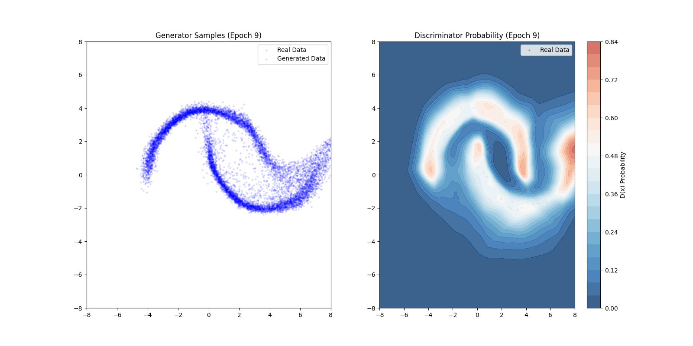

# \[Name\]

   \[Abstract\]

   Teaser figures. MNIST generated samples. 

   

    


   Setup conda env. 
   ```
   conda create -n env python=3.13 -y
   conda create -p ~/xt/condaenvs/env python=3.13 -y
   ```
   Install relevant packages. 
   ```
   pip install torch \
      torchvision \
      scikit-learn \
      numpy \
      matplotlib \
      pyyaml \
      tqdm \
      ipython \
      debugpy \
      wandb \
      scipy
   ```

## Implementation Details 

### Model Flexibility 

   In the MLP, even adding one more fully connected layer caused mode collapse, and playing around with the hyperparameters and increasing the discriminator/generator training epoch ratio to 50:1 didn't do anything. 


